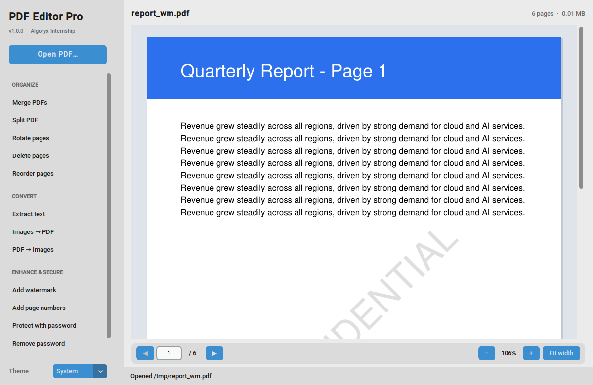
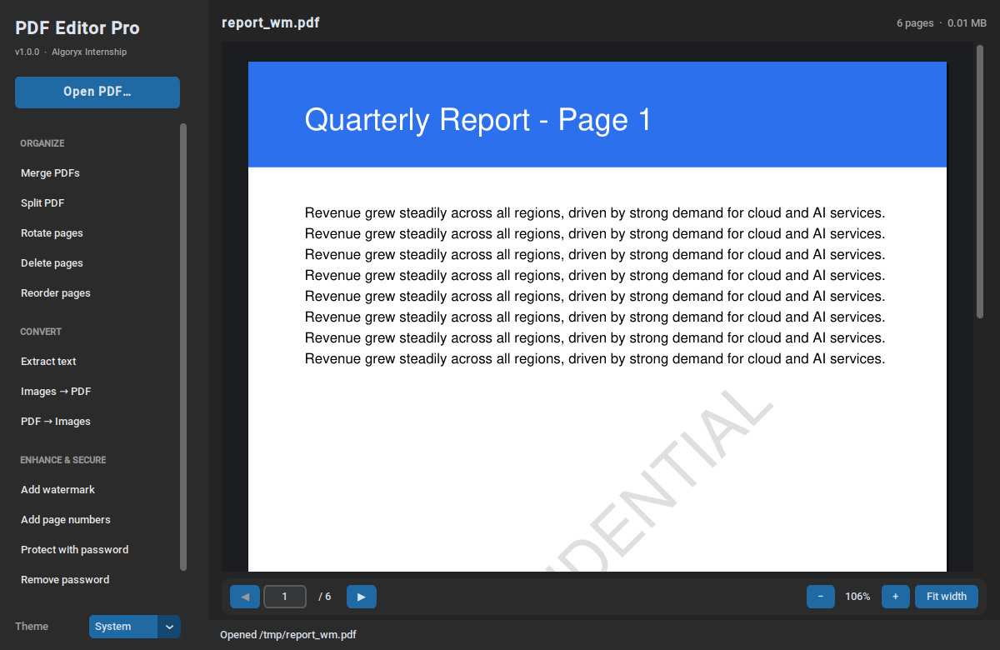
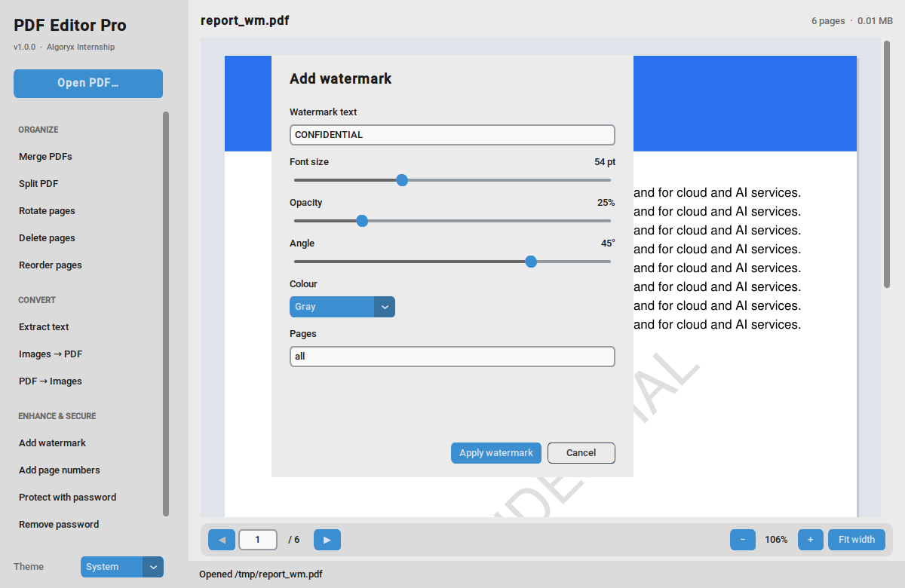
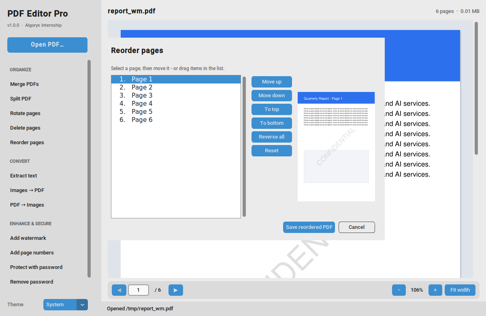

# PDF Editor Pro

A modern desktop **PDF editor written in Python** with a clean graphical interface.
Built for the **Algoryx Python Internship – Task 2 (PDF Editor Application)**.



<details>
<summary>Dark mode & dialogs</summary>

| Dark mode | Watermark | Reorder |
|---|---|---|
|  |  |  |

</details>

## Features (13 — the task requires 5)

| Group | Feature | Details |
|---|---|---|
| **Organize** | Merge PDFs | Any number of files, drag-order with Move up/down, per-file page counts |
| | Split PDF | One file per page · every *N* pages · custom ranges (`1-3;4;5-9`) |
| | Rotate pages | 90° right / 180° / 90° left on all or selected pages |
| | Delete pages | Page-range syntax (`1-3,7,10-`) |
| | Reorder pages | Move up/down, to top/bottom, reverse, **drag-and-drop**, live thumbnail |
| **Convert** | Extract text | In-app viewer, copy to clipboard, save `.txt`; detects scanned PDFs |
| | Images → PDF | PNG/JPG/BMP/TIFF/WebP/GIF, A4-fit or original size, EXIF-aware |
| | PDF → Images | PNG or JPG, 72–300 DPI, page selection |
| **Enhance & Secure** | Text watermark | Text, size, opacity, angle, colour, page selection — correct on rotated pages |
| | Page numbers | "Page X of Y", upright on rotated pages |
| | Password protection | AES-256, print/copy permissions |
| | Remove password | Save an unlocked copy |
| | Compress / repair | Shows size saved; also rewrites damaged PDFs cleanly |
| **Viewer** | Page preview | Prev/next, jump to page, zoom, fit-width, Ctrl+wheel zoom, light/dark theme |
| **Robustness** | Corrupted-PDF handling | Empty, truncated, non-PDF, wrong password → friendly message, never a crash |

Originals are **never overwritten** — every operation writes a new file.

## Quick start

Requires **Python 3.11+**.

```bash
git clone https://github.com/<your-username>/pdf-editor-pro.git
cd pdf-editor-pro

python -m venv .venv
# Windows:  .venv\Scripts\activate
# macOS/Linux:  source .venv/bin/activate

pip install -r requirements.txt
python main.py            # or:  python main.py path/to/file.pdf
```


### Keyboard shortcuts

| Key | Action |
|---|---|
| `Ctrl+O` | Open PDF |
| `←` / `→`, `PgUp` / `PgDn` | Previous / next page (click the preview first) |
| `Ctrl` + mouse wheel, `Ctrl +` / `Ctrl -` | Zoom |

## Executable build

```bash
python build_exe.py       # -> dist/PDFEditorPro.exe  (on Windows)
```

Run it on the OS you want to target. A GitHub Actions workflow
(`.github/workflows/build-windows.yml`) builds the Windows `.exe` automatically:
push a tag like `v1.0.0` (or run the workflow manually) and download the file from the
run's **Artifacts** / the **Release** page.

## Tests

```bash
pytest                    # core logic (54 tests)
xvfb-run -a pytest        # Linux headless: also runs the GUI end-to-end tests
```

62 tests cover every feature, error paths (corrupted / encrypted / invalid input) and GUI flows.

## Project structure

```
pdf-editor-pro/
├── main.py                     # entry point
├── build_exe.py                # PyInstaller build script
├── requirements.txt
├── src/pdfeditor/
│   ├── exceptions.py           # custom exception hierarchy
│   ├── logger.py               # console + rotating file logging
│   ├── core/                   # ← no GUI code, fully testable
│   │   ├── service.py          #   PDFService: every PDF operation
│   │   └── utils.py            #   page-range parser, path helpers
│   └── gui/
│       ├── app.py              #   main window, background job runner
│       ├── dialogs.py          #   one dialog per feature
│       ├── preview.py          #   page preview widget
│       └── widgets.py          #   base dialog, password prompt, file list
├── tests/                      # pytest suite
└── docs/                       # architecture, user guide, screenshots
```

See [`docs/ARCHITECTURE.md`](docs/ARCHITECTURE.md) for design details and
[`docs/USER_GUIDE.md`](docs/USER_GUIDE.md) for step-by-step usage.

## Tech stack

| Purpose | Library |
|---|---|
| PDF engine | [PyMuPDF](https://pymupdf.readthedocs.io/) |
| Images | [Pillow](https://python-pillow.org/) |
| GUI | [CustomTkinter](https://customtkinter.tomschimansky.com/) |
| Tests / packaging | pytest, PyInstaller |

## Logging

Logs go to the console and to `~/.pdf_editor_pro/logs/pdf_editor.log` (rotating, 1 MB × 3).

## License

MIT — see [LICENSE](LICENSE).
